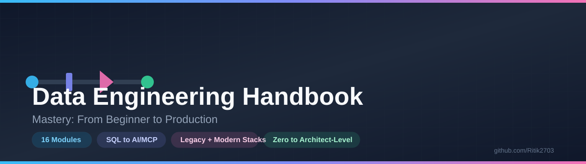
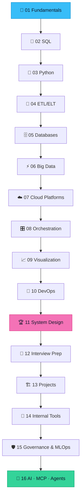
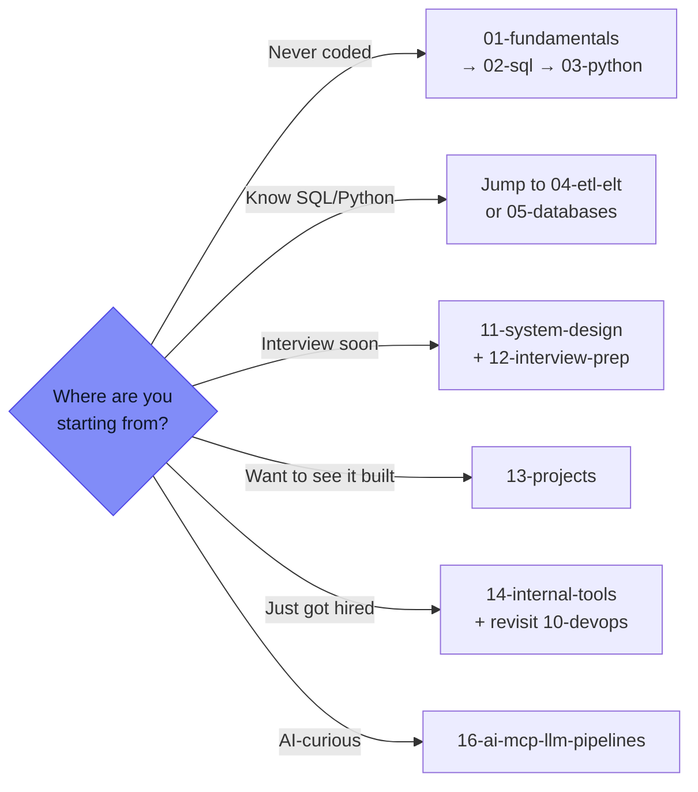

<div align="center">



<br/>

[](#-all-16-modules)
[](./LICENSE)
[](./CONTRIBUTING.md)
[](#)
[](#-all-16-modules)

<br/>

### The only Data Engineering resource that teaches you **WHY** before **HOW** — <br/>from your first `SELECT` statement to building your own **AI agents and MCP servers**.

<br/>

**[🚀 Start the Roadmap](./ROADMAP.md)** &nbsp;•&nbsp; **[📚 Browse All Modules](#-all-16-modules)** &nbsp;•&nbsp; **[📖 resources](./resources.md)** &nbsp;•&nbsp; **[📇 Glossary](./GLOSSARY.md)**

</div>

<br/>

## Why This Repo Exists

> Most Data Engineering content teaches **syntax**. It rarely teaches **judgment** — why Kafka exists, why Netflix built Iceberg instead of using Hive, or why a Senior Data Engineer reasons differently than a junior one about the exact same problem.

This handbook was built to close that gap — **one consistent pattern, repeated across 16 modules and 200+ files**:

<table>
<tr><td width="20%" align="center"><b>WHAT</b></td><td>Plain-language definition — no jargon assumed</td></tr>
<tr><td align="center"><b>WHY</b></td><td>The real production/business problem it solved, and at which company</td></tr>
<tr><td align="center"><b>HOW</b></td><td>Mechanics, with real code — not toy pseudocode</td></tr>
<tr><td align="center"><b>THEN vs NOW</b></td><td>Legacy tool ↔ modern tool, mapped side by side</td></tr>
<tr><td align="center"><b>WHO</b></td><td>Real company context — who uses this, and why they chose it</td></tr>
<tr><td align="center"><b>TRAP</b></td><td>The exact interview question this topic tends to generate</td></tr>
</table>

<br/>

## What's Inside (at a glance)

<div align="center">

| Knowledge | Practical | Career |
|:---:|:---:|:---:|
| 16 Modules | 6 Full End-to-End Projects | 1 Golden System-Design Module |
| 200+ Files | Real Runnable Code Everywhere | 300+ Interview Questions |
| 40+ Case Studies | Legacy **+** Modern Stacks | A Complete 90-Day Study Plan |

</div>

<br/>

## Your Learning Journey



<div align="center">
<sub> Pink = the "Golden Module" that separates a Data Engineer from a Senior/Architect &nbsp;|&nbsp; Green = the 2026 AI frontier</sub>
</div>

<br/>

## All 16 Modules

<details open>
<summary><b>Foundations</b> — Modules 01-05</summary>
<br/>

| # | Module | Covers |
|---|---|---|
| 01 | [`01-fundamentals/`](./01-fundamentals/) | Core DE concepts, data modeling, warehousing, big data, cloud, pipeline architecture |
| 02 | [`02-sql/`](./02-sql/) | Beginner → production SQL, window functions, real company case studies, **interactive playground** |
| 03 | [`03-python/`](./03-python/) | Python for DE — every library, cloud SDKs, Microsoft Graph API, master reference file |
| 04 | [`04-etl-elt/`](./04-etl-elt/) | ETL/ELT deep dive — SSIS/Informatica internals to ADF/Glue/dbt |
| 05 | [`05-databases/`](./05-databases/) | DB history to AI-era vector DBs, real company database choices |

</details>

<details open>
<summary><b>⚙️ Engines & Infrastructure</b> — Modules 06-10</summary>
<br/>

| # | Module | Covers |
|---|---|---|
| 06 | [`06-big-data/`](./06-big-data/) | Hadoop to Spark internals, streaming, lakehouse formats, Scala for Spark |
| 07 | [`07-cloud-platforms/`](./07-cloud-platforms/) | Migration playbook, AWS/Azure/GCP, FinOps, security, Terraform |
| 08 | [`08-orchestration/`](./08-orchestration/) | Airflow internals, Dagster/Prefect, production monitoring |
| 09 | [`09-visualization/`](./09-visualization/) | Excel to Tableau/Power BI, DAX, semantic layer, AI-powered BI |
| 10 | [`10-devops/`](./10-devops/) | Git/CI-CD/Docker/Kubernetes, DevOps specifically for Data Engineers |

</details>

<details open>
<summary><b>Judgment & Career</b> — Modules 11-14</summary>
<br/>

| # | Module | Covers |
|---|---|---|
| 11 | [`11-system-design/`](./11-system-design/) | **The Golden Module** — the judgment that makes you Senior/Architect, 7 full case studies |
| 12 | [`12-interview-prep/`](./12-interview-prep/) | Resume, behavioral, technical, system design interviews, negotiation |
| 13 | [`13-projects/`](./13-projects/) | 6 full end-to-end pipelines — legacy stack **to** modern cloud stack |
| 14 | [`14-internal-tools/`](./14-internal-tools/) | Bonus: Jira, Confluence, Slack, PagerDuty — the tools nobody teaches |

</details>

<details open>
<summary><b>2026 Frontier</b> — Modules 15-16</summary>
<br/>

| # | Module | Covers |
|---|---|---|
| 15 | [`15-governance-quality-mlops/`](./15-governance-quality-mlops/) | GDPR/CCPA, data catalogs, MDM, data quality/observability, MLOps, Data Mesh |
| 16 | [`16-ai-mcp-llm-pipelines/`](./16-ai-mcp-llm-pipelines/) | RAG, **Model Context Protocol (MCP)**, build your own MCP server, AI agents, AI-powered BI |

</details>

<br/>

## Find Your Path



<br/>

## Built on Real Company Reasoning, Not Just Theory

<div align="center">

| Company | What They Built & Why (covered in-depth) |
|---|---|
| **Netflix** | Apache Iceberg, Chaos Monkey — module 06, 07 |
| **Uber** | Apache Hudi, Schemaless — module 06, 05 |
| **LinkedIn** | Apache Kafka — module 06, 08 |
| **Airbnb** | Apache Airflow, Superset — module 08, 09 |
| **Meta** | Presto, RocksDB, TAO — module 06, 05 |
| **Capital One** | Full cloud migration in a regulated industry — module 07 |

</div>

<br/>

## Get Started

```bash
git clone https://github.com/Ritik2703/Data-Engineering-Handbook-Mastery-From-Beginner-to-Production.git
cd Data-Engineering-Handbook-Mastery-From-Beginner-to-Production
open ROADMAP.md   # start here
```

<br/>

## Additional resources

| File | Purpose |
|---|---|
| [`ROADMAP.md`](./ROADMAP.md) | The complete stage-by-stage path through this repo |
| [`resources.md`](./resources.md) | Curated YouTube channels, blogs, books, courses, communities |
| [`GLOSSARY.md`](./GLOSSARY.md) | A-Z cross-module terminology index for quick interview revision |
| [`CONTRIBUTING.md`](./CONTRIBUTING.md) | How to contribute to this repo |

<br/>

## Contributing

PRs are genuinely welcome. See [`CONTRIBUTING.md`](./CONTRIBUTING.md) — this repo follows one consistent pattern (concept → why it matters → how it works → legacy vs modern → real company context → interview traps) that new contributions should match.

<br/>

## ⭐ If This Helped You

If this repo genuinely helped you learn, land an interview, or level up — a ⭐ **star** helps far more people discover it. Sharing it with one person learning Data Engineering is even better.

<br/>

## License

MIT — use freely, attribution appreciated.

---

<div align="center">

🙏 **राधे राधे | जय श्री हरिवंश** 🙏

*"Knowledge shared freely returns multiplied — build with patience, teach with generosity, and let the work speak for itself."*

Compiled with dedication by **[Ritik2703](https://github.com/Ritik2703)** — Data Engineering Handbook: Beginner to Production

</div>
